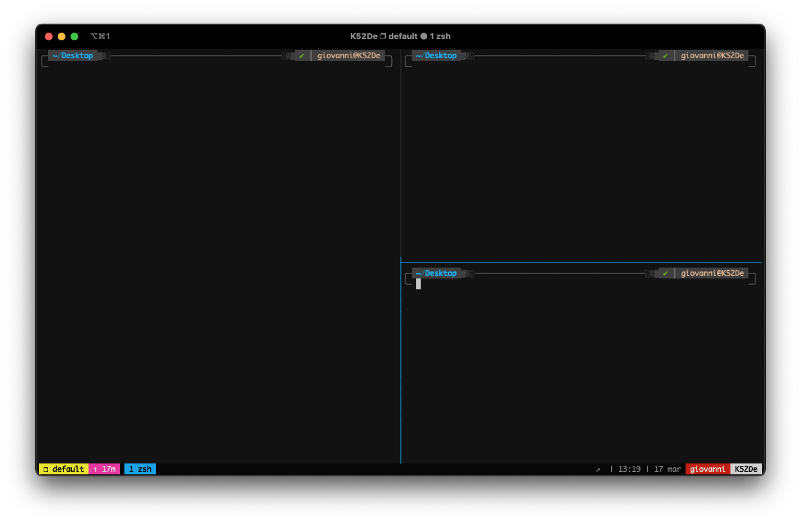

<!--
*** Thanks for checking out the Best-README-Template. If you have a suggestion
*** that would make this better, please fork the repo and create a pull request
*** or simply open an issue with the tag "enhancement".
*** Thanks again! Now go create something AMAZING! :D
-->

<!-- PROJECT LOGO -->
<br />
<p align="center">
  <a href="https://github.com/GiovanniBaccichet/dotfiles">
    
  </a>

  <h3 align="center">.files</h3>

  <p align="center">
    My current dotfiles setup
    <br />
    <a href="https://github.com/GiovanniBaccichet/">My Profile 👨🏻‍💻</a>
    |
    <a href="https://github.com/GiovanniBaccichet/dotfiles/issues">Report Bug 🐛</a>
    |
    <a href="https://github.com/GiovanniBaccichet/dotfiles/issues">Request Feature ✨</a>
  </p>
</p>

<!-- ABOUT THE PROJECT -->

## About The Project

I am creating this repo for allowing the future me to just clone it and have a cool looking and functional environment, instead of reconfiguring my setup each time I screw something up and I have no choice but to reinstall everything.

<p align="center">
<a href="https://github.com/GiovanniBaccichet/dotfiles">
    
</a>
</p>

The final result can be seen in the screenshot above. Nothing too crazy but elegant and most importantly functional.

<!-- USAGE -->

## Usage

To clone the repo and start the installation scripts use the following commands:

```bash
git clone https://github.com/GiovanniBaccichet/dotfiles ~/.dotfiles
sudo bash ~/.dotfiles/install/copy_all.sh
git clone --depth=1 https://gitee.com/romkatv/powerlevel10k.git ${ZSH_CUSTOM:-$HOME/.oh-my-zsh/custom}/themes/powerlevel10k
```

<!-- CONTRIBUTE -->

## Contribute

Contributions are what make the open source community such an amazing place to be learn, inspire, and create. Any contributions you make are **greatly appreciated**.

1. Fork the Project
2. Create your Feature Branch (`git checkout -b feature/AmazingFeature`)
3. Commit your Changes (`git commit -m 'Add some AmazingFeature'`)
4. Push to the Branch (`git push origin feature/AmazingFeature`)
5. Open a Pull Request

<!-- ACKNOWLEDGEMENTS -->

## Acknowledgements

-   [Oh My Zsh](https://github.com/ohmyzsh/ohmyzsh)
-   [tmux](https://github.com/tmux/tmux)
-   [Powerlevel10k](https://github.com/romkatv/powerlevel10k)

<!-- FUTURE WORK -->

## Future Work

Automating the deployment of my dotfiles.

<!-- LICENSE -->

## License

Distributed under the GPLv3 License. See `LICENSE` for more information.

<!-- CONTACT -->

## Contact

Giovanni Baccichet - [@Giovanni_Bacci](https://twitter.com/Giovanni_Bacci) - `giovanni[at]baccichet.org`
